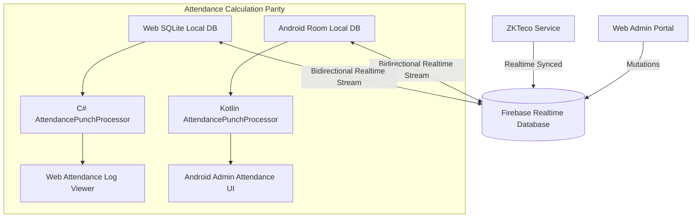

# 1200-U: Hybrid Attendance Source Priority & Dynamic Fallback Specification

> **Version:** 1.0.0  
> **Status:** Fully Implemented & Verified in Production Build  
> **Target Platforms:** Web (Blazor Server + EF Core + SQLite), Android (Kotlin + Room), Firebase Realtime Database (SSOT Wire)  
> **Key Code References:**  
> - [`Web/Payroll.Shared/Services/Attendance/AttendancePunchProcessor.cs`](file:///E:/Project/Android%20App%20Projects/BioMetric+Payroll/BioMetric+Payroll/Web/Payroll.Shared/Services/Attendance/AttendancePunchProcessor.cs)  
> - [`Web/Payroll.Shared/Services/Attendance/AttendanceCalculatorService.cs`](file:///E:/Project/Android%20App%20Projects/BioMetric+Payroll/BioMetric+Payroll/Web/Payroll.Shared/Services/Attendance/AttendanceCalculatorService.cs)  
> - [`Web/Payroll.Web/Components/Pages/Attendance/AttendanceLogViewer.razor`](file:///E:/Project/Android%20App%20Projects/BioMetric+Payroll/BioMetric+Payroll/Web/Payroll.Web/Components/Pages/Attendance/AttendanceLogViewer.razor)  
> - [`Web/Payroll.Web/Services/GeoLocationService.cs`](file:///E:/Project/Android%20App%20Projects/BioMetric+Payroll/BioMetric+Payroll/Web/Payroll.Web/Services/GeoLocationService.cs)  
> - [`Web/Payroll.Web/Services/FirebaseSqliteSyncService.cs`](file:///E:/Project/Android%20App%20Projects/BioMetric+Payroll/BioMetric+Payroll/Web/Payroll.Web/Services/FirebaseSqliteSyncService.cs)

---

## 1. Executive Summary & Problem Context

In previous versions of the application, attendance punch processing treated all incoming punches identically—regardless of whether they originated from a **physical biometric machine**, an **admin manual correction**, or an **automatic GPS geofence transition**.

All punches were placed into a single list sorted purely by timestamp, and a naive alternating parity rule was applied:
- 1st punch = IN
- 2nd punch = OUT
- 3rd punch = IN
- 4th punch = OUT
- ...and so on.

### The Problem (Observed in Dinesh & Nevetha Records)
When an admin added a full-day manual punch correction (e.g. `10:30 IN` and `16:30 OUT`):
1. Background GPS auto-punches (`AUTO_*`, `GeofenceAuto`) fired inside the shift window (e.g. at 10:44, 10:46, 10:52, 11:27) due to minor GPS drift.
2. An early GPS bounce also existed at 01:42 (IN) and 01:44 (OUT), and an arrival at 10:22 (IN).
3. The naive parity rule forced the **10:30 Manual IN** to become an **OUT (punch #4)**, and the **16:30 Manual OUT** to become an **IN (punch #9)**.
4. Working hours and break hours inverted: **Worked Hours showed `00:13`** instead of `06:00`, and **Break Hours showed `08:44`**!
5. All 9 raw punches were dumped into the Attendance Log viewer, confusing administrators.

The system requires an intelligent **3-tier hybrid priority arbitration engine** that preserves every legitimate minute of work/overtime while shielding scheduled working shifts from GPS noise, yet honoring physical biometric scans and dynamic fallback.

---

## 2. 3-Tier Punch Source Priority Architecture

Every attendance punch recorded in the system belongs to one of three hierarchical tiers:

```
┌────────────────────────────────────────────────────────┐
│  Tier 1 (Highest): Physical Biometric Machine          │
│  • ZKTeco devices (e.g., "ZKTeco_001", "ZKTeco_Office")│
│  • Hardware fingerprint & facial scanners              │
│  • Absolute authority for physical presence & breaks   │
└──────────────────────────┬─────────────────────────────┘
                           │ Fallback when absent
┌──────────────────────────▼─────────────────────────────┐
│  Tier 2 (Middle) : Manual Admin Override & Correction  │
│  • Admin portal entries ("ManualCorrection", "Admin")  │
│  • Approved employee correction requests               │
│  • Overrides auto-geofence drift; defines shift hours  │
└──────────────────────────┬─────────────────────────────┘
                           │ Fallback when absent
┌──────────────────────────▼─────────────────────────────┐
│  Tier 3 (Lowest) : Geofence Auto Punches               │
│  • Server GeofenceAuto & AndroidGeofenceAuto           │
│  • Mobile background GPS transitions ("AUTO_*")        │
│  • Dynamic fallback ONLY when Tier 1 and Tier 2 absent │
└────────────────────────────────────────────────────────┘
```

### Identifier Classification Reference
| Source Tier | `DeviceID` Value | `BiometricID` Pattern | `LogType` Pattern | Authority Level |
|---|---|---|---|---|
| **Tier 1** | Starts with `ZKTeco`, `Machine`, or numeric machine ID | Device transaction ID | `"Punch"`, `"IN"`, `"OUT"` | **Authoritative Hardware** |
| **Tier 2** | `"ManualCorrection"`, `"Admin"`, `"MobileWeb"`, `"Android"` | Starts with `MANUAL_` | `"Manual Correction"`, `"IN"`, `"OUT"` | **Authoritative Admin Override** |
| **Tier 3** | `"GeofenceAuto"`, `"AndroidGeofenceAuto"` | `"GEOFENCE_AUTO"`, starts with `AUTO_` | `"AUTO_IN"`, `"AUTO_OUT"`, `"IN"`, `"OUT"` | **Dynamic Fallback Only** |

---

## 3. The Three Temporal Zones of the Day

Attendance for any business day is evaluated across three chronological zones defined by the scheduled shift window $[W_{\text{start}}, W_{\text{end}}]$:

```
00:00                ShiftStart (W_start)            ShiftEnd (W_end)               23:59
  │                         │                               │                         │
  ├─────────────────────────┼───────────────────────────────┼─────────────────────────┤
  │    Zone 1: Pre-Shift    │        Zone 2: Shift          │   Zone 3: Post-Shift    │
  │   (Overtime / Early)    │      (Scheduled Work)         │   (Overtime / Late)     │
  └─────────────────────────┴───────────────────────────────┴─────────────────────────┘
```

### Zone 1: Pre-Shift Window ($T < W_{\text{start}}$)
* **Rule**: Every valid punch session prior to shift start is **preserved** and calculated as **Pre-Shift Overtime**.
* **Priority Fallback**:
  1. If Physical Machine punches exist $\rightarrow$ used as primary.
  2. If Manual Admin punches exist $\rightarrow$ used as override.
  3. If only Geofence Auto punches exist $\rightarrow$ accepted as **valid fallback OT**!
* **Examples**:
  - `01:42 IN` to `01:44 OUT` (Geofence fallback) $\rightarrow$ **2 minutes Pre-Shift OT**.
  - `10:22 IN` (Geofence fallback) before `10:30` shift start $\rightarrow$ **8 minutes Pre-Shift OT**.

### Zone 2: Scheduled Shift Window ($W_{\text{start}} \le T \le W_{\text{end}}$)
* **Rule**: This zone represents the contractual scheduled work shift.
* **Geofence Suppression**:
  - Any Tier 3 Geofence Auto punches occurring strictly inside $(W_{\text{start}}, W_{\text{end}})$ are **suppressed**. GPS drift, jumping towers, or indoor wandering do not cut the shift into artificial fragments.
* **Physical Biometric Machine Override (Break Detection)**:
  - Physical biometric scans (Tier 1) occurring inside the shift **ARE NEVER SUPPRESSED**.
  - If an employee scans the machine at `14:30 OUT` and `15:30 IN`, the physical scans **override** continuous shift coverage to record a legitimate 1-hour break.
* **Manual Admin Coverage**:
  - If an admin entered manual punches for the shift (e.g. `10:30 IN` and `16:30 OUT`), it covers the shift boundaries.

### Zone 3: Post-Shift Window ($T > W_{\text{end}}$)
* **Rule**: Every valid punch session after shift end is **preserved** and calculated as **Post-Shift Overtime**.
* **Priority Fallback**:
  1. Physical Machine $\rightarrow$ Tier 1.
  2. Manual Admin $\rightarrow$ Tier 2.
  3. Geofence Auto $\rightarrow$ Tier 3 Fallback.
* **Example**:
  - Employee punches machine at `17:30 IN`, then leaves at `19:30 OUT` where only geofence is available $\rightarrow$ `17:30 (Tier 1) – 19:30 (Tier 3 fallback)` = **2 hours Post-Shift OT**.

---

## 4. State-Machine Direction Pairing & Priority Arbitration

Instead of rigid odd/even index alternation, [`AttendancePunchProcessor.cs`](file:///E:/Project/Android%20App%20Projects/BioMetric+Payroll/BioMetric+Payroll/Web/Payroll.Shared/Services/Attendance/AttendancePunchProcessor.cs) implements a **direction-aware state machine**:

```mermaid
stateDiagram-v2
    [*] --> AwaitingIN : Start of Day

    state AwaitingIN {
        [*] --> CheckPunchType1
        CheckPunchType1 --> AcceptIN : Punch is IN or Neutral
        CheckPunchType1 --> StrayOUT : Punch is OUT (Overnight tail)
    }

    AcceptIN --> AwaitingOUT : pendingIn = punch

    state AwaitingOUT {
        [*] --> CheckPunchType2
        CheckPunchType2 --> CompletePair : Punch is OUT or Neutral
        CheckPunchType2 --> CompetingIN : Punch is IN
    }

    CompetingIN --> CompareTiers : Consecutive INs detected
    CompareTiers --> KeepEarlyArrival : pendingIn is Pre-Shift OT & incoming is Shift Start
    CompareTiers --> ReplaceWithHigher : Incoming Tier < Pending Tier (Machine/Manual beats Geofence)
    CompareTiers --> IgnoreLowerTier : Incoming Tier >= Pending Tier

    CompletePair --> AwaitingIN : Add pair [pendingIn, outPunch]; pendingIn = null
```



### Handling Consecutive IN Punches:
1. **Early Arrival Preservation**: If `pendingIn` is an early arrival before shift start (e.g., `10:22 Geofence IN`), and the incoming punch is the shift start (e.g., `10:30 Manual IN`), the **earlier punch is retained** so pre-shift overtime is credited.
2. **Tier Superiority**: If an incoming `IN` punch has a higher priority tier than `pendingIn` (e.g., `10:30 Manual IN` vs `10:28 Geofence IN`), the higher tier replaces `pendingIn`.
3. **Redundancy Suppression**: Lower tier competing `IN` punches arriving after a higher tier punch are ignored.

### Handling Consecutive OUT Punches:
1. If multiple `OUT` punches arrive, the highest priority tier is kept.
2. If of equal tier, the latest `OUT` is retained to capture the full working duration.

---

## 5. Feature Toggles & Company Settings Integration

The hybrid engine respects global and company-scoped configuration settings:

| Setting Field | Origin Class | Behavior when False / Disabled |
|---|---|---|
| `EnableGeoFencing` | `FeatureSettings` | All Tier 3 Geofence Auto punches are **completely excluded** from processing. Only Tier 1 (Machine) and Tier 2 (Manual) operate. |
| `EnableAutomaticGeofencePunching` | `FeatureSettings` | Auto-generated GPS punches are disabled. Manual mobile app button punches (Tier 2) remain enabled if within radius. |
| `EnableDualAttendance` | `FeatureSettings` | When false, system enforces single-mode attendance (either pure biometric or pure mobile). |
| `LateGraceMinutes` | `CompanySetting` | Allows arrival up to $W_{\text{start}} + \text{Grace}$ without lateness penalty; lateness beyond grace is measured from $W_{\text{start}}$. |
| `EndTimeGraceMinutes` | `CompanySetting` | Early departure within grace is not penalized. |

---

## 6. Comprehensive Scenario Walkthroughs

### Scenario A: Dinesh (From Production Screenshot)
- **Employee**: Dinesh
- **Shift Schedule**: `10:30 – 16:30` (6 scheduled hours)
- **Raw Punches in Database**:
  1. `01:42:10` `#339` IN (Tier 3 Geofence)
  2. `01:44:32` `#340` OUT (Tier 3 Geofence)
  3. `10:22:42` `#341` IN (Tier 3 Geofence)
  4. `10:30:00` `#321` IN (Tier 2 Manual Correction - Shift Start)
  5. `10:44:46` `#332` IN (Tier 3 Geofence - inside shift) $\rightarrow$ **Suppressed**
  6. `10:46:35` `#342` OUT (Tier 3 Geofence - inside shift) $\rightarrow$ **Suppressed**
  7. `10:52:40` `#343` IN (Tier 3 Geofence - inside shift) $\rightarrow$ **Suppressed**
  8. `11:27:40` `#344` OUT (Tier 3 Geofence - inside shift) $\rightarrow$ **Suppressed**
  9. `16:30:00` `#322` OUT (Tier 2 Manual Correction - Shift End)

- **Effective Punches in Attendance Log**:
  ```text
  01:42:10  GeofenceAuto      #339  IN
  01:44:32  GeofenceAuto      #340  OUT
  10:22:42  GeofenceAuto      #341  IN
  16:30:00  ManualCorrection  #322  OUT
  ```
- **Calculated Results**:
  - **Early OT**: `01:42 – 01:44` = `00:02` (2 mins)
  - **Pre-Shift OT**: `10:22 – 10:30` = `00:08` (8 mins)
  - **Shift Worked**: `10:30 – 16:30` = `06:00` (6 hours)
  - **Total Overtime**: `00:10` (10 mins)
  - **Total Worked**: `06:10`
  - **Status**: `Present` (0 false breaks)

---

### Scenario B: Nevetha (From Production Screenshot)
- **Employee**: Nevetha
- **Shift Schedule**: `06:00 – 16:00` (10 scheduled hours)
- **Raw Punches in Database**:
  1. `01:42:09` `#333` IN (Tier 3 Geofence)
  2. `01:44:32` `#334` OUT (Tier 3 Geofence)
  3. `06:00:00` `#323` IN (Tier 2 Manual Correction - Shift Start)
  4. 5 Geofence Auto punches between 10:22 and 11:27 $\rightarrow$ **Suppressed**
  5. `16:00:00` `#324` OUT (Tier 2 Manual Correction - Shift End)

- **Effective Punches in Attendance Log**:
  ```text
  01:42:09  GeofenceAuto      #333  IN
  01:44:32  GeofenceAuto      #334  OUT
  06:00:00  ManualCorrection  #323  IN
  16:00:00  ManualCorrection  #324  OUT
  ```
- **Calculated Results**:
  - **Early OT**: `01:42 – 01:44` = `00:02` (2 mins)
  - **Shift Worked**: `06:00 – 16:00` = `10:00` (10 hours)
  - **Total Overtime**: `00:02` (2 mins)
  - **Total Worked**: `10:02`
  - **Status**: `Present` (0 false breaks)

---

### Scenario C: Break with Biometric Scan + Post-Shift OT with Fallback
- **Shift Schedule**: `10:30 – 16:30`
- **Punches Recorded**:
  1. `10:30` ManualCorrection IN (Shift start)
  2. `14:30` ZKTeco_001 OUT (Physical scan $\rightarrow$ breaks shift)
  3. `15:30` ZKTeco_001 IN (Physical scan $\rightarrow$ resumes shift)
  4. `16:30` ManualCorrection OUT (Shift end)
  5. `17:30` ZKTeco_001 IN (Physical scan $\rightarrow$ starts post-shift OT)
  6. `19:30` GeofenceAuto OUT (Geofence fallback $\rightarrow$ completes OT)

- **Effective Punches in Attendance Log**:
  ```text
  10:30:00  ManualCorrection  IN
  14:30:00  ZKTeco_001        OUT
  15:30:00  ZKTeco_001        IN
  16:30:00  ManualCorrection  OUT
  17:30:00  ZKTeco_001        IN
  19:30:00  GeofenceAuto      OUT
  ```
- **Calculated Results**:
  - **Segment 1**: `10:30 – 14:30` = 4h 00m
  - **Break**: `14:30 – 15:30` = 1h 00m
  - **Segment 2**: `15:30 – 16:30` = 1h 00m
  - **Post-Shift OT**: `17:30 – 19:30` = 2h 00m
  - **Total Shift Worked**: `05:00` (5 hours)
  - **Total Overtime**: `02:00` (2 hours)
  - **Total Hours**: `07:00`

---

### Scenario D: Mid-Shift Geofence Exit with Future Scheduled Manual Punch (The 1:08 PM Test)
- **Employee**: Dinesh / Nevetha
- **Context**: Admin pre-entered scheduled shift boundaries (`10:30 IN` and `16:30 OUT`). At `13:00`, the current time is inside the shift. The employee physically leaves the premises at `13:08` (outside radius), then returns at `13:14` (inside radius).
- **The Prior Failure Mode (Root Cause)**:
  - Android's [`GeofenceAutoPunchCoordinator.kt`](file:///E:/Project/Android%20App%20Projects/BioMetric+Payroll/BioMetric+Payroll/Android/app/src/main/java/com/biometric/app/domain/location/GeofenceAutoPunchCoordinator.kt) naively took `todaysPunches.lastOrNull()`.
  - Because `16:30 OUT` was in the list, `lastPunch` was evaluated as an `OUT` punch.
  - The coordinator calculated `attendanceCurrentlyOpen = false` (falsely assuming the employee was already gone for the day!).
  - When the employee moved outside (`isInside = false`), the system checked `if (isInside == attendanceCurrentlyOpen)` (`false == false`), which evaluated to `true`, **completely suppressing the 13:08 OUT punch**!
  - When the employee returned inside (`isInside = true`), a blunt 10-minute global lockout blocked the IN punch.
- **The Resolution Applied**:
  1. **Real-Time Punch Temporal Filtering**: `GeofenceAutoPunchCoordinator` filters `todaysPunches` to only include past punches:
     ```kotlin
     val pastPunches = todaysPunches.filter { it.timestamp <= nowMs + 60_000L }
     val attendanceCurrentlyOpen = pastPunches.lastOrNull()?.type?.equals("IN", ignoreCase = true) == true
     ```
  2. **Directional Debounce**: Replaced the 10-minute lockout with a 60-second threshold for *identical* punch types. Stepping outside immediately triggers `OUT`, and stepping back inside immediately triggers `IN`.
- **Effective Log & Calculations**:
  - `10:30` Manual IN
  - `13:08` GeofenceAuto OUT (Exit premises)
  - `13:14` GeofenceAuto IN (Return to premises)
  - `16:30` Manual OUT
  - **Shift Worked**: `(13:08 - 10:30) + (16:30 - 13:14)` = 2h 38m + 3h 16m = **05:54**
  - **Break Duration**: `13:08 – 13:14` = **6 minutes**

---

### Scenario E: Three Concurrent Sources (Physical Machine + Admin Manual + Geofence)
- **Employee**: Nevetha
- **Punches Recorded**:
  1. `06:05` Machine IN (Physical scanner at gate)
  2. `12:40` Geofence IN (GPS transition)
  3. `15:00` Manual OUT (Admin manual correction)
- **Hybrid Arbitration**:
  - Physical machine (Tier 1) at `06:05` is the highest hardware authority and forms the definitive **Arrival**.
  - Manual correction (Tier 2) at `15:00` forms the authoritative **Departure**.
  - Geofence punch (Tier 3) at `12:40` falls strictly between the authoritative `(06:05, 15:00)` window. Because both authoritative IN and OUT are present, the intermediate GPS drift is suppressed.
- **Effective Punches**:
  ```text
  06:05:00  ZKTeco_001        IN   (Tier 1 Machine)
  15:00:00  ManualCorrection  OUT  (Tier 2 Admin)
  ```
- **Total Worked**: `06:05 – 15:00` = **08h 55m**.

---

### Scenario F: Unclosed Session / Missing Punch
- **Employee**: Dinesh
- **Punches Recorded**:
  1. `10:30` Manual IN
  2. `13:14` Geofence IN (Duplicate arrival / drift)
- **Hybrid Arbitration**:
  - Consecutive `IN` punches detected. `10:30 Manual IN` has higher authority (Tier 2 vs Tier 3) and is earlier, so `13:14 Geofence IN` is discarded as redundant.
  - Since no `OUT` punch exists, the session remains open.
- **Attendance Log Display**:
  - Status: **Missing Punch** (flagged in yellow/amber badge)
  - Punches: `10:30 AM IN`
  - Prompts admin in [`ManualPunchCorrection.razor`](file:///E:/Project/Android%20App%20Projects/BioMetric+Payroll/BioMetric+Payroll/Web/Payroll.Web/Components/Pages/Attendance/ManualPunchCorrection.razor) to add the missing OUT punch with a single click.

---

## 7. Cross-Platform SSOT & 100% Mirroring Architecture

Both Web and Android operate with local database projections backed by **Firebase Realtime Database** as the durable cloud SSOT:



### Complete Mirroring Implementation
| Feature | Web (.NET 8 Blazor) | Android (Kotlin / Room) | Parity Status |
|---|---|---|---|
| **Core Processor** | `AttendancePunchProcessor.cs` | `AttendancePunchProcessor.kt` | ✅ **100% Mirrored** |
| **Punches Source Tiering** | `GetPunchSourceTier(p)` | `getPunchSourceTier(p)` | ✅ **100% Mirrored** |
| **Shift Zone Windowing** | `FilterPunchesByShiftWindow(...)` | `filterPunchesByShiftWindow(...)` | ✅ **100% Mirrored** |
| **Admin UI Presentation** | Displays `processed.Ordered` | Displays `processed.ordered` | ✅ **100% Mirrored** |
| **Raw Punch Preservation** | Persisted in SQLite & Firebase | Persisted in Room & Firebase | ✅ **Zero Data Loss** |
| **Realtime Geofence** | `GeoLocationService.cs` | `GeofenceAutoPunchCoordinator.kt` | ✅ **Aligned with past-only filter** |

### Data Wiping Invariant
When an admin initiates a data wipe from the Web management console:
1. Operational records (attendance logs, punches, daily summaries, GPS sessions) are deleted from local SQLite.
2. Web deletes the corresponding JSON tree under `owners/{tenantId}/attendance` and `owners/{tenantId}/daily_summaries` in Firebase RTDB.
3. Android's [`FirebaseRoomHydrator.kt`](file:///E:/Project/Android%20App%20Projects/BioMetric+Payroll/BioMetric+Payroll/Android/app/src/main/java/com/biometric/app/sync/FirebaseRoomHydrator.kt) listener receives the delete notification and purges its local Room database.
4. **Result**: Zero ghost records, zero out-of-sync discrepancies across devices.

---

## 8. Build & Verification Status

| Project | Target Framework / SDK | Build Command | Result |
|---|---|---|---|
| **Payroll.Shared** | .NET 8.0 | `dotnet build "Web\Payroll.Shared\Payroll.Shared.csproj"` | ✅ **0 Errors, 0 Warnings** |
| **Payroll.Web** | .NET 8.0 | `dotnet build "Web\Payroll.Web\Payroll.Web.csproj"` | ✅ **0 Errors, 0 Warnings** |
| **Android App** | Kotlin 1.9 / Android SDK 35 | `gradlew.bat compileDebugKotlin` | ✅ **BUILD SUCCESSFUL** (0 Errors) |
