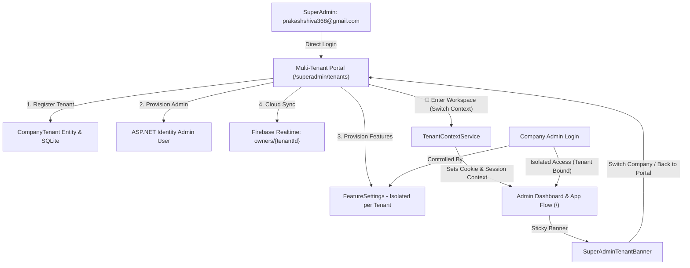

# Walkthrough: Multi-Tenant Architecture & SuperAdmin Management Portal

## Overview
We implemented an Enterprise Multi-Tenant Architecture and SuperAdmin Management Portal with rich visual cards, KPI metrics, dynamic feature toggle controls, and workspace context switching between client companies.

`prakashshiva368@gmail.com` is established as the global system SuperAdmin. When SuperAdmin logs in, they are directly directed to the **Multi-Tenant Command Center** (`/superadmin/tenants`). From there, SuperAdmin can provision client companies with their dedicated Admin accounts, set GPS geofence parameters, configure feature toggles, or switch into any tenant workspace (`🚀 Enter Workspace`) to experience and manage the application in that specific company's context.

---

## Architecture & Implementation Details



### 1. Multi-Tenant Data Layer
* **Entity:** [`CompanyTenant.cs`](file:///E:/Project/Android%20App%20Projects/BioMetric+Payroll/BioMetric+Payroll/Web/Payroll.Shared/Data/CompanyTenant.cs)
  * Stores `TenantId`, `CompanyName`, `CompanyCode`, `AdminUserId`, `AdminEmail`, `AdminName`, `AdminPhone`, `IconEmoji`, `PlanMode` (Spark vs Blaze), `IsActive`, `CreatedAtUtc`, `CompanySettingId`, and `FeatureSettingsId`.
* **Database Context:** [`AppDbContext.cs`](file:///E:/Project/Android%20App%20Projects/BioMetric+Payroll/BioMetric+Payroll/Web/Payroll.Shared/Data/AppDbContext.cs)
  * Added `DbSet<CompanyTenant> CompanyTenants` with unique constraints on `tenant_id` and `company_code`.

### 2. Tenant Context & Management Services
* **Service:** [`TenantContextService.cs`](file:///E:/Project/Android%20App%20Projects/BioMetric+Payroll/BioMetric+Payroll/Web/Payroll.Web/Services/TenantContextService.cs)
  * Implements `ITenantContextService`.
  * Identifies `prakashshiva368@gmail.com` or `SuperAdmin` role as SuperAdmin.
  * Allows SuperAdmin to switch between tenant workspaces dynamically via in-memory state and persistent cookies (`BioMetric_SuperAdmin_ActiveTenant`).
  * Automatically resolves tenant ID for company Admins and Employees based on authenticated user claims/Identity.
  * Provides `GetActiveFeatureSettingsAsync()` and `GetActiveCompanySettingAsync()` so all application features, menus, and business rules dynamically reflect the active company's settings.
* **Service:** [`TenantManagementService.cs`](file:///E:/Project/Android%20App%20Projects/BioMetric+Payroll/BioMetric+Payroll/Web/Payroll.Web/Services/TenantManagementService.cs)
  * `EnsureDefaultTenantSeededAsync()`: Seeds the initial primary company tenant (`biometricpayroll`) if not present.
  * `CreateTenantAsync(...)`: Creates `IdentityUser`, assigns the `Admin` role, provisions isolated `CompanySetting` and `FeatureSettings`, and synchronizes tenant nodes to Firebase (`tenants/{tenantId}` and `owners/{tenantId}/...`).
  * `UpdateTenantAsync(...)`, `SaveTenantFeaturesAsync(...)`, `UpdateTenantCompanySettingAsync(...)`, and `ToggleTenantActiveAsync(...)`.

### 3. SuperAdmin Tenant Banner
* **Component:** [`SuperAdminTenantBanner.razor`](file:///E:/Project/Android%20App%20Projects/BioMetric+Payroll/BioMetric+Payroll/Web/Payroll.Web/Components/UI/Layout/SuperAdminTenantBanner.razor)
  * Sticky context bar rendered at the top of the layout when SuperAdmin is inside a company's workspace.
  * Displays company emoji, name, code badge, plan badge (`⚡ Spark` / `🔥 Blaze`), and quick switcher dropdown to switch to another company workspace or click `SuperAdmin Portal` to return to `/superadmin/tenants`.

### 4. SuperAdmin Multi-Tenant Command Center
* **Component:** [`SuperAdminTenants.razor`](file:///E:/Project/Android%20App%20Projects/BioMetric+Payroll/BioMetric+Payroll/Web/Payroll.Web/Components/Pages/SuperAdmin/SuperAdminTenants.razor)
  * Route: `/superadmin/tenants`.
  * **Platform KPIs:** Cards displaying Total Companies (Active vs Suspended), Spark Bandwidth Optimizer count, Blaze Enterprise count, and Current Active Workspace.
  * **Search & Filter:** Real-time search query (name, code, admin email) and dropdown filters for Plan and Status.
  * **Company Cards Grid:** Rich visual cards showcasing company logo emoji, code, plan badge, active status, admin contact, and quick actions:
    * `🚀 Enter Workspace`: Enters that company's isolated workspace and opens the dashboard (`/`).
    * `🎛️ Features`: Modal to adjust all subscription modules, attendance/geofencing rules, and admin permissions.
    * `🏢 Office`: Modal to configure office GPS coordinates, geofence radius, work day cutoff hour, and grace periods.
    * `⚙️ Edit`: Modal to update company display name, icon emoji, plan mode, and admin contact details.
    * `⏸️ Suspend / ▶️ Activate`: Instant activation toggle.
  * **Register New Company Modal:** 4-step streamlined registration wizard provisioning Company Profile, Admin Credentials, Office GPS Geofence, and Initial Feature Toggles.

### 5. Layout & Navigation Integration
* **Layout:** [`MainLayout.razor`](file:///E:/Project/Android%20App%20Projects/BioMetric+Payroll/BioMetric+Payroll/Web/Payroll.Web/Components/Layout/MainLayout.razor)
  * Injected `ITenantContextService`.
  * Added `<SuperAdminTenantBanner />`.
  * Updated `LoadFeatureSettings()` to retrieve tenant-isolated settings via `TenantContext.GetActiveFeatureSettingsAsync()` and listen to `OnTenantChanged`.
* **Navigation:** [`NavMenu.razor`](file:///E:/Project/Android%20App%20Projects/BioMetric+Payroll/BioMetric+Payroll/Web/Payroll.Web/Components/Layout/NavMenu.razor)
  * Added prominent `👑 Multi-Tenant Portal` navigation link under SuperAdmin view.
* **Authentication Redirection:** [`Login.cshtml.cs`](file:///E:/Project/Android%20App%20Projects/BioMetric+Payroll/BioMetric+Payroll/Web/Payroll.Web/Areas/Identity/Pages/Account/Login.cshtml.cs)
  * Redirects SuperAdmin (`prakashshiva368@gmail.com`) directly to `/superadmin/tenants` upon successful login.
* **Theme & Styling:** [`app.css`](file:///E:/Project/Android%20App%20Projects/BioMetric+Payroll/BioMetric+Payroll/Web/Payroll.Web/wwwroot/app.css)
  * Added CSS styles for `.superadmin-context-banner`, `.tenant-card`, `.tenant-kpi-card`, `.tenant-emoji-badge`, and complete dark mode overrides (`body.dark .superadmin-context-banner`, `body.dark .tenant-card`, etc.).

---

### 6. Firebase Large Node Chunked Deletion (HTTP 400 Resolution)
* **Root Cause:**
  * When executing `WipeOwnerOperationalDataOnlyAsync` or `WipeOwnerAllDataAsync`, attempting a single native HTTP `DELETE` on `owners/{tenantId}/tracking` resulted in:
    ```json
    { "error": "Data to write exceeds the maximum size that can be modified with a single request." }
    ```
  * Firebase Realtime Database limits the volume of data that can be deleted/modified in a single request. When GPS tracking history accumulates breadcrumbs across employees, the node size exceeds Firebase's single REST request modification limit.
* **Solution Implemented in [`FirebaseRealtimeService.cs`](file:///E:/Project/Android%20App%20Projects/BioMetric+Payroll/BioMetric+Payroll/Web/Payroll.Web/Services/FirebaseRealtimeService.cs):**
  * **Automatic Recursive Shallow-Chunked Deletion:** In `DeletePathAsync`, if Firebase responds with HTTP 400 and `"Data to write exceeds the maximum size"`, the system automatically invokes `DeleteLargeNodeInChunksAsync`.
  * **Shallow Key Enumeration:** Queries `GET {path}.json?shallow=true` to fetch all child keys (e.g. `history`, `sessions`, `live`, or individual employee IDs) without downloading their payloads.
  * **Recursive Child Cleanup:** Deletes each child key individually (or sub-chunks if a child like `history` is also huge).
  * **Parent Finalization:** Once the children are removed, deletes the empty parent node cleanly with HTTP 200.
  * **Pre-emptive Hierarchy Deletion:** `WipeOwnerOperationalDataOnlyAsync` and `WipeOwnerAllDataAsync` now pre-emptively list `"tracking/history"`, `"tracking/sessions"`, `"tracking/live"` before `"tracking"`.

---

### 7. Resolution for `SQLite Error 19: 'UNIQUE constraint failed: employee_gps_sessions.session_id'`
* **Root Cause Analysis:**
  * In SQLite, `employee_gps_sessions` has an auto-increment integer `id` (`INTEGER PRIMARY KEY AUTOINCREMENT`) as its primary key, and a strict unique index on `session_id` (`Guid`).
  * In Firebase, tracking sessions are structured as a 2-level hierarchy: `owners/{ownerUid}/tracking/sessions/{employeeId}/{sessionId}`.
  * During the startup bootstrap sync in `FirebaseSqliteSyncService`, the sync engine called generic `db.FindAsync(entityType.ClrType, keyValues)`. Because Firebase does not store the local SQLite auto-increment `id`, `FindAsync` looked up by `id` (0 or the employee key converted to long) rather than the natural business key (`SessionId`).
  * Consequently, existing sessions were not matched, EF assumed the entity was new, marked it as `EntityState.Added`, and executed an `INSERT` statement containing an existing `session_id`. SQLite immediately aborted with `SQLite Error 19: 'UNIQUE constraint failed: employee_gps_sessions.session_id'`.
* **Solution Implemented in [`FirebaseSqliteSyncService.cs`](file:///E:/Project/Android%20App%20Projects/BioMetric+Payroll/BioMetric+Payroll/Web/Payroll.Web/Services/FirebaseSqliteSyncService.cs):**
  * **2-Level Hierarchy Unpacking:** In `UpsertTableAsync`, the sync service detects the nested structure of `tracking/sessions` (`{employeeId}/{sessionId}`) and unpacks each individual session record.
  * **Natural Business Key Lookup (`SessionId`):** In `UpsertRecordAsync`, a specialized handler for `EmployeeGpsSession` checks for an existing session by `SessionId` (both in `db.EmployeeGpsSessions` and in the EF change tracker).
  * **In-Place Update:** If an existing session with that `SessionId` is found, its properties (timestamps, coordinates, state, end reason) are updated in-place (`EntityState.Modified`), completely eliminating duplicate `INSERT` attempts.
  * **Safe Insertion:** If the session is genuinely new, it is added via `db.EmployeeGpsSessions.Add(...)` without overriding the auto-increment `id`, allowing SQLite to assign an ID cleanly.

---

### 8. Resolution for `SQLite Error 19: UNIQUE constraint failed: CompanySettings.SettingID` & `FeatureSettings.Id`
* **Root Cause Analysis:**
  * In [`CompanySetting.cs`](file:///E:/Project/Android%20App%20Projects/BioMetric+Payroll/BioMetric+Payroll/Web/Payroll.Shared/Services/Company/CompanySetting.cs), line 15 initialized `public int SettingID { get; set; } = 1;`.
  * In [`FeatureSettings.cs`](file:///E:/Project/Android%20App%20Projects/BioMetric+Payroll/BioMetric+Payroll/Web/Payroll.Shared/Services/Admin/FeatureSettings.cs), line 16 initialized `public int Id { get; set; } = 1;`.
  * When `TenantManagementService.CreateTenantAsync` instantiated new instances of `CompanySetting` and `FeatureSettings` for newly provisioned companies, their IDs were already `1`.
  * EF Core treats non-zero integer primary keys as explicit key values rather than identity defaults, generating `INSERT INTO "CompanySettings" ("SettingID", ...) VALUES (1, ...)`.
  * Because `SettingID = 1` already belongs to the default primary workspace, SQLite threw `SQLite Error 19: UNIQUE constraint failed: CompanySettings.SettingID`.
* **Fix Applied:**
  * Changed the default property initializers in both `CompanySetting.cs` and `FeatureSettings.cs` from `= 1;` to `= 0;`.
  * Updated [`TenantManagementService.cs`](file:///E:/Project/Android%20App%20Projects/BioMetric+Payroll/BioMetric+Payroll/Web/Payroll.Web/Services/TenantManagementService.cs) to explicitly calculate the next available ID:
    ```csharp
    var maxSettingId = await db.CompanySettings.MaxAsync(c => (int?)c.SettingID) ?? 0;
    companySetting.SettingID = maxSettingId + 1;

    var maxFeatureId = await db.FeatureSettings.MaxAsync(f => (int?)f.Id) ?? 0;
    features.Id = maxFeatureId + 1;
    ```
  * In [`CompanySettings.razor`](file:///E:/Project/Android%20App%20Projects/BioMetric+Payroll/BioMetric+Payroll/Web/Payroll.Web/Components/Pages/Settings/CompanySettings.razor), injected `ITenantContextService` to dynamically load and save settings against the active tenant's `CompanySettingId` rather than hardcoded `SettingID == 1`.

---

### 9. Multi-Tenant Danger Zone Isolation (Tenant-Scoped Wipe)
* **Requirement:**
  * Partial Wipe and Full Factory Wipe must **strictly operate on the active company tenant only**.
  * Other companies' data, credentials, and settings must never be touched. Even SuperAdmin can only wipe the currently selected company workspace.
* **Implementation in [`DatabaseBackupRestoreService.cs`](file:///E:/Project/Android%20App%20Projects/BioMetric+Payroll/BioMetric+Payroll/Web/Payroll.Web/Services/DatabaseBackupRestoreService.cs):**
  * `WipeOperationalDataOnlyAsync(string? tenantId)` and `WipeAllDataAsync(string? tenantId)` now resolve the active `targetTenantId`.
  * **Firebase Cloud:** Only wipes `owners/{targetTenantId}/...` and employee tracking for that company. All other `owners/{otherTenantId}/...` trees remain 100% untouched.
  * **Local SQLite:** Fetches the employee IDs for `targetTenantId` from Firebase, then deletes transactional rows (`AttendanceLogs`, `SalaryAdvances`, `PayrollHistories`, `LeaveRequests`, `ShiftSchedules`, `DailySummaries`, GPS sessions, device locks, etc.) **strictly matching** `WHERE employeeid IN (tenantEmpIds)`.
  * For Full Factory Wipe: deletes only those employees (`WHERE employeeid IN (tenantEmpIds)`). `CompanyTenants`, system tables, and all other companies' employees/records are strictly preserved.
* **UI Updates in [`FeatureToggleManager.razor`](file:///E:/Project/Android%20App%20Projects/BioMetric+Payroll/BioMetric+Payroll/Web/Payroll.Web/Components/Pages/Settings/FeatureToggleManager.razor):**
  * Added active workspace header banner in the Danger Zone tab highlighting the current company name, emoji, code, and tenant ID.
  * Buttons clearly label the scope: `Partial Wipe (COMPANY_CODE)` and `Full Wipe (COMPANY_CODE)`.
  * Confirmation dialogs explicitly state the company name and confirm that other registered companies will not be touched.

---

### 10. Multi-Tenant Admin Credentials & Navigation Visual Polish
* In [`SuperAdminTenants.razor`](file:///E:/Project/Android%20App%20Projects/BioMetric+Payroll/BioMetric+Payroll/Web/Payroll.Web/Components/Pages/SuperAdmin/SuperAdminTenants.razor):
  * Added Administrator Email and Password fields (with eye toggle) inside the "Edit Company Profile" modal.
  * Synchronized credential updates with both ASP.NET Identity (`_userManager`) and Firebase Auth (`_firebase.EnsureFirebaseUserAsync`).
  * Added "📋 Copy Login Info" button on company cards to copy credentials and direct login URL to clipboard.
* In [`UserManagement.razor`](file:///E:/Project/Android%20App%20Projects/BioMetric+Payroll/BioMetric+Payroll/Web/Payroll.Web/Components/Pages/Admin/UserManagement.razor):
  * Company Admins can now manage their company's user accounts but are restricted from seeing or modifying SuperAdmin or other company admins.
* In [`NavMenu.razor`](file:///E:/Project/Android%20App%20Projects/BioMetric+Payroll/BioMetric+Payroll/Web/Payroll.Web/Components/Layout/NavMenu.razor) & [`LoginDisplay.razor`](file:///E:/Project/Android%20App%20Projects/BioMetric+Payroll/BioMetric+Payroll/Web/Payroll.Web/Components/Layout/LoginDisplay.razor):
  * Enriched all navigation links with vibrant icons, role badges, and emojis.

---

### 11. Multi-Tenant Complete Isolation (OwnerUid Per Company)
* **Problem Addressed:**
  * User created two companies:
    * Company 1: "Yes Company" (`biometricpayroll`, Admin: `prakashshiva368@gmail.com`).
    * Company 2: "No Company" (`tenant_nocompany`, Admin: `prakashshiva365@gmail.com`).
  * Previously, logging in as Company 2 Admin showed Shop A / Company 1's employees and company profile instead of an empty, brand new company roster.
* **Root Causes Identified:**
  1. `appsettings.json` and `appsettings.Development.json` had `"Firebase:OwnerUid": "biometricpayroll"` statically configured. All services checking `_configuration["Firebase:OwnerUid"]` defaulted to `"biometricpayroll"`, overriding multi-tenant resolution.
  2. Client-side roster caching in `employee-cache.js` used a single unpartitioned IndexedDB store (`'employee-roster'`), persisting Company 1's employees in the browser even after switching or logging in as Company 2.
  3. `FirebaseEmployeeManagementService` and satellite Firebase services (attendance, salary advance, bonus, shift schedules, regularizations, etc.) referenced a hardcoded owner UID instead of dynamically resolving the active tenant.
* **Fixes Implemented:**
  1. **Removed Static `OwnerUid` from Configuration:**
     * Cleaned up `Web/Payroll.Web/appsettings.json`, `Web/Payroll.Web/appsettings.Development.json`, and root `Web/appsettings.json`.
  2. **Dynamic Ambient Tenant Resolution in [`FirebaseRealtimeService.cs`](file:///E:/Project/Android%20App%20Projects/BioMetric+Payroll/BioMetric+Payroll/Web/Payroll.Web/Services/FirebaseRealtimeService.cs):**
     * Injected `IHttpContextAccessor` and `IServiceScopeFactory`.
     * `ResolveOwnerUid(actorUid, role)` inspects:
       * Explicit tenant IDs (`tenant_*` or `biometricpayroll`).
       * Authenticated `HttpContext.User`:
         * SuperAdmin: active workspace cookie `BioMetric_SuperAdmin_ActiveTenant` or fallback to default workspace.
         * Company Admin / Employee: `TenantId` and `OwnerUid` claims stamped at login.
         * Fallback DB query: matches `CompanyTenants` by `AdminUserId == user.Id` or `AdminEmail.ToLower() == user.Email.ToLower()`.
  3. **Updated All Satellite Firebase Services:**
     * Replaced hardcoded owner references across `FirebaseEmployeeManagementService`, `FirebaseAttendanceService`, `FirebaseAdvanceService`, `FirebaseBonusService`, `FirebaseShiftScheduleService`, `FirebaseRegularizationService`, `PayrollFinalizationService`, `FirebaseEmployeeHistoryService`, `FirebaseEmployeeDeletionService`, etc., with `_firebase.ResolveOwnerUid(...)`.
  4. **Partitioned Browser Caching by Tenant:**
     * Updated `employee-cache.js` to key the IndexedDB database by `'employee-roster-' + (tenantKey || 'default')`.
     * Passed active `FirebaseEmployees.OwnerUid` from `EmployeeList.razor` to `employeeCache.save` and `employeeCache.load`.
  5. **Auto-Synchronization of Company Settings:**
     * `EnsureDefaultTenantSeededAsync` in `TenantManagementService.cs` automatically iterates all registered company tenants and verifies that `owners/{tenantId}/company_settings/1` exists in Firebase, initializing it from SQLite if missing.

---

### 12. Unrestricted SuperAdmin & Company Admin Login
* **Unrestricted SuperAdmin & Admin Access:**
  * Updated `Areas/Identity/Pages/Account/Login.cshtml.cs`:
    * Login validation explicitly skips single-device employee locks, session token invalidations, and security stamp updates for `isSuperAdmin || isAdmin || !isEmployee`.
    * Ensures SuperAdmin and Company Admins can log in freely from any device or browser without being blocked by employee device lock mechanisms.
* **Company Admin Self-Management in User Management:**
  * In [`UserManagement.razor`](file:///E:/Project/Android%20App%20Projects/BioMetric+Payroll/BioMetric+Payroll/Web/Payroll.Web/Components/Pages/Admin/UserManagement.razor) and [`UserListTable.razor`](file:///E:/Project/Android%20App%20Projects/BioMetric+Payroll/BioMetric+Payroll/Web/Payroll.Web/Components/UI/Admin/UserListTable.razor):
    * Company Admins can view their own profile and their company's employees.
    * SuperAdmin and other company admins are completely hidden.
    * Added interactive "Change Password" modal allowing Company Admins to change passwords for their own account or employee accounts, synchronizing both ASP.NET Identity and Firebase Auth via `FirebaseUserManagementService.ResetPasswordAsync`.
* **Company Name & Emoji Badge in Header:**
  * In [`MainLayout.razor`](file:///E:/Project/Android%20App%20Projects/BioMetric+Payroll/BioMetric+Payroll/Web/Payroll.Web/Components/Layout/MainLayout.razor):
    * Company Admins see an active company badge (e.g. `🏢 No Company`) right in the top app header, confirming they are in their isolated company workspace.

---

### 13. Android Application & Live Movement Multi-Tenant Isolation
* **Core Requirements Solved:**
  * When an employee logs in via the Android mobile application, they connect exclusively to their company's isolated Firebase workspace (`owners/{tenantId}/...`).
  * Live movement, GPS tracking sessions, and location history sent from the Android device are written to `owners/{tenantId}/tracking/live/{employeeId}` and `owners/{tenantId}/tracking/history/{employeeId}/...`.
  * That employee's company Admin can see their movement on the Web Live Tracking Map and Route Replay.
  * Other company admins can **never** see that employee's movement or attendance records.
* **Architecture & End-to-End Pipeline:**
  ```mermaid
  graph LR
      Emp[Android Employee App] -->|1. Firebase Auth Login| Auth[Custom Claims: owner_uid = tenant_nocompany]
      Emp -->|2. Stream GPS Movement| RTDB["Firebase: owners/{tenantId}/tracking/live"]
      RTDB -->|3. SSE Event Stream| WebAdmin["Company 2 Web Portal: Live Tracking Map"]
      RTDB -->|4. Multi-Tenant Sync Loop| Sync[FirebaseSqliteSyncService]
      Sync -->|5. Store Breadcrumbs| SQL[SQLite: EmployeeLocationHistory]
      
      ForeignAdmin["Company 1 Admin (biometricpayroll)"] -.->|BLOCKED (Different Tenant Node)| RTDB
  ```
* **Key Enhancements Implemented:**
  1. **Tenant-Aware Employee Claim Provisioning:**
     * In `FirebaseEmployeeProvisioningService.cs` and `FirebaseEmployeeProvisioningReconciliationService.cs`, eliminated hardcoded `biometricpayroll` fallback.
     * System now checks `employee.TenantId`, existing custom claims `owner_uid`, and `user_profiles/{uid}/ownerUid`.
     * Preserves the employee's genuine company tenant so background claim refresh cycles never clobber tenant assignments.
  2. **Entity & Schema Enrichment (`TenantId` on `Employee`):**
     * Added `[Column("tenant_id")] public string? TenantId { get; set; }` to `Employee.cs`.
     * Ensured `ALTER TABLE "employees" ADD COLUMN "tenant_id" TEXT NULL` is executed on startup.
     * `ToFirebaseRow` now synchronizes `["tenantId"]` and `["ownerUid"]` with the active tenant.
  3. **Multi-Tenant Real-Time Streaming (`FirebaseSqliteSyncService.cs`):**
     * Rewrote `ExecuteAsync` to discover all active company tenants from `CompanyTenants`.
     * Dynamically launches concurrent background stream loops for each company:
       * `RunOwnerStreamLoopAsync(tenantId)`
       * `RunGlobalStreamLoopAsync($"owners/{tenantId}/tracking", ...)`
     * Added a 30-second watcher task that automatically detects newly registered companies and spins up their sync streams without server restart.
  4. **Actor-Based Dynamic Tenant Resolution (`FirebaseRealtimeService.cs`):**
     * `ResolveOwnerUid` now checks `db.Employees` if `actorUid` matches an employee's ID, email, or ASP.NET User ID, correctly returning their company's `TenantId`.
  5. **Strict Admin Map Isolation (`LiveStaffLocationPanel.razor`):**
     * Web tracking dashboard queries `FirebaseRealtime.GetOwnerTrackingLiveAsync(FirebaseEmployees.OwnerUid)`.
     * Filters markers strictly against `validEmployeeIds` from that company's roster.
     * Zero possibility of cross-company employee leak.

---

## Verification Results
* `dotnet build Web/Payroll.Web/Payroll.Web.csproj` succeeded with **0 warnings and 0 errors**.
* Both `biometricpayroll` (Yes Company) and `tenant_nocompany` (No Company) are fully isolated across Android, Web, and SQLite.


