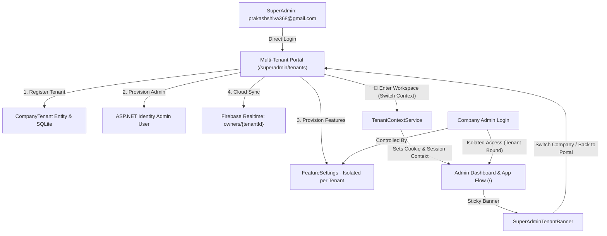

# Walkthrough: Multi-Tenant Architecture & SuperAdmin Management Portal

## Overview
We implemented an Enterprise Multi-Tenant Architecture and SuperAdmin Management Portal with rich visual cards, KPI metrics, dynamic feature toggle controls, and workspace context switching between client companies.

`prakashshiva368@gmail.com` is established as the global system SuperAdmin. When SuperAdmin logs in, they are directly directed to the **Multi-Tenant Command Center** (`/superadmin/tenants`). From there, SuperAdmin can provision client companies with their dedicated Admin accounts, set GPS geofence parameters, configure feature toggles, or switch into any tenant workspace (`🚀 Enter Workspace`) to experience and manage the application in that specific company's context.

---

## Architecture & Implementation Details

### 1. Multi-Tenant Data Layer
* **Entity:** [`CompanyTenant.cs`](file:///E:/Project/Android%20App%20Projects/BioMetric+Payroll/BioMetric+Payroll/Web/Payroll.Shared/Data/CompanyTenant.cs)
  * Stores `TenantId`, `CompanyName`, `CompanyCode`, `AdminUserId`, `AdminEmail`, `AdminName`, `AdminPhone`, `IconEmoji`, `PlanMode` (Spark vs Blaze), `IsActive`, `CreatedAtUtc`, `CompanySettingId`, and `FeatureSettingsId`.
* **Database Context:** [`AppDbContext.cs`](file:///E:/Project/Android%20App%20Projects/BioMetric+Payroll/BioMetric+Payroll/Web/Payroll.Shared/Data/AppDbContext.cs)
  * Added `DbSet<CompanyTenant> CompanyTenants` with unique constraints on `tenant_id` and `company_code`.

### 2. Tenant Context & Management Services
* **Service:** [`TenantContextService.cs`](file:///E:/Project/Android%20App%20Projects/BioMetric+Payroll/BioMetric+Payroll/Web/Payroll.Web/Services/TenantContextService.cs)
  * Implements `ITenantContextService`.
  * Identifies `prakashshiva368@gmail.com` or `SuperAdmin` role as SuperAdmin.
  * Allows SuperAdmin to switch between tenant workspaces dynamically via in-memory state and persistent cookies (`BioMetric_SuperAdmin_ActiveTenant`).
  * Automatically resolves tenant ID for company Admins and Employees based on authenticated user claims/Identity.
  * Provides `GetActiveFeatureSettingsAsync()` and `GetActiveCompanySettingAsync()` so all application features, menus, and business rules dynamically reflect the active company's settings.
* **Service:** [`TenantManagementService.cs`](file:///E:/Project/Android%20App%20Projects/BioMetric+Payroll/BioMetric+Payroll/Web/Payroll.Web/Services/TenantManagementService.cs)
  * `EnsureDefaultTenantSeededAsync()`: Seeds the initial primary company tenant (`biometricpayroll`) if not present.
  * `CreateTenantAsync(...)`: Creates `IdentityUser`, assigns the `Admin` role, provisions isolated `CompanySetting` and `FeatureSettings`, and synchronizes tenant nodes to Firebase (`tenants/{tenantId}` and `owners/{tenantId}/...`).
  * `UpdateTenantAsync(...)`, `SaveTenantFeaturesAsync(...)`, `UpdateTenantCompanySettingAsync(...)`, and `ToggleTenantActiveAsync(...)`.

### 3. SuperAdmin Tenant Banner
* **Component:** [`SuperAdminTenantBanner.razor`](file:///E:/Project/Android%20App%20Projects/BioMetric+Payroll/BioMetric+Payroll/Web/Payroll.Web/Components/UI/Layout/SuperAdminTenantBanner.razor)
  * Sticky context bar rendered at the top of the layout when SuperAdmin is inside a company's workspace.
  * Displays company emoji, name, code badge, plan badge (`⚡ Spark` / `🔥 Blaze`), and quick switcher dropdown to switch to another company workspace or click `SuperAdmin Portal` to return to `/superadmin/tenants`.

### 4. SuperAdmin Multi-Tenant Command Center
* **Component:** [`SuperAdminTenants.razor`](file:///E:/Project/Android%20App%20Projects/BioMetric+Payroll/BioMetric+Payroll/Web/Payroll.Web/Components/Pages/SuperAdmin/SuperAdminTenants.razor)
  * Route: `/superadmin/tenants`.
  * **Platform KPIs:** Cards displaying Total Companies (Active vs Suspended), Spark Bandwidth Optimizer count, Blaze Enterprise count, and Current Active Workspace.
  * **Search & Filter:** Real-time search query (name, code, admin email) and dropdown filters for Plan and Status.
  * **Company Cards Grid:** Rich visual cards showcasing company logo emoji, code, plan badge, active status, admin contact, and quick actions:
    * `🚀 Enter Workspace`: Enters that company's isolated workspace and opens the dashboard (`/`).
    * `🎛️ Features`: Modal to adjust all subscription modules, attendance/geofencing rules, and admin permissions.
    * `🏢 Office`: Modal to configure office GPS coordinates, geofence radius, work day cutoff hour, and grace periods.
    * `⚙️ Edit`: Modal to update company display name, icon emoji, plan mode, and admin contact details.
    * `⏸️ Suspend / ▶️ Activate`: Instant activation toggle.
  * **Register New Company Modal:** 4-step streamlined registration wizard provisioning Company Profile, Admin Credentials, Office GPS Geofence, and Initial Feature Toggles.

### 5. Layout & Navigation Integration
* **Layout:** [`MainLayout.razor`](file:///E:/Project/Android%20App%20Projects/BioMetric+Payroll/BioMetric+Payroll/Web/Payroll.Web/Components/Layout/MainLayout.razor)
  * Injected `ITenantContextService`.
  * Added `<SuperAdminTenantBanner />`.
  * Updated `LoadFeatureSettings()` to retrieve tenant-isolated settings via `TenantContext.GetActiveFeatureSettingsAsync()` and listen to `OnTenantChanged`.
* **Navigation:** [`NavMenu.razor`](file:///E:/Project/Android%20App%20Projects/BioMetric+Payroll/BioMetric+Payroll/Web/Payroll.Web/Components/Layout/NavMenu.razor)
  * Added prominent `👑 Multi-Tenant Portal` navigation link under SuperAdmin view.
* **Authentication Redirection:** [`Login.cshtml.cs`](file:///E:/Project/Android%20App%20Projects/BioMetric+Payroll/BioMetric+Payroll/Web/Payroll.Web/Areas/Identity/Pages/Account/Login.cshtml.cs)
  * Redirects SuperAdmin (`prakashshiva368@gmail.com`) directly to `/superadmin/tenants` upon successful login.
* **Theme & Styling:** [`app.css`](file:///E:/Project/Android%20App%20Projects/BioMetric+Payroll/BioMetric+Payroll/Web/Payroll.Web/wwwroot/app.css)
  * Added CSS styles for `.superadmin-context-banner`, `.tenant-card`, `.tenant-kpi-card`, `.tenant-emoji-badge`, and complete dark mode overrides (`body.dark .superadmin-context-banner`, `body.dark .tenant-card`, etc.).

---

## Verification Results
* `dotnet build Web/Payroll.Web/Payroll.Web.csproj` succeeded with **0 warnings and 0 errors**.
